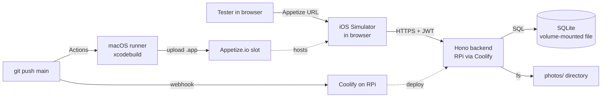

# Native iOS Port — Design Spec

**Date:** 2026-05-06
**Author:** brainstorming session w/ Claude
**Status:** Draft — awaiting user review

## 1. Goal

Port the existing Expo/React Native field-service technician prototype (`app/`) to a fully native iOS app written in Swift/SwiftUI, backed by a small HTTP service with persistent storage, and ship a build that external testers can exercise from a browser without installing anything on their own phones.

The visual and interaction language stays 1:1 with the existing prototype (PRODUCT.md, DESIGN.md). The prototype itself stays untouched as a reference rendering — this work adds a new native client and a new backend, it does not replace the RN tree.

## 2. Decisions log

The following decisions were made interactively with the user during the brainstorming session and lock the rest of the spec:

| # | Decision | Choice |
|---|---|---|
| 1 | External test surface | GitHub Actions builds simulator `.app`, uploads to Appetize.io free tier (browser-based iPhone simulator). No Apple Developer Program required. |
| 2 | Scope of port | Full UI — three screens (Today, JobDetail, Capture), four demo scenarios, all components in `app/src/components/`. |
| 3 | Backend stack & hosting | Bun + Hono + `bun:sqlite`, Dockerized, deployed to user's existing Raspberry Pi via Coolify. |
| 4 | Auth model | Production-grade: email + password login, JWT (15 min) + opaque refresh token (30 days, rotated, reuse-detection). Argon2id hashing. Account lockout after 5 failures. Tokens in iOS Keychain. Face ID / Touch ID re-auth on app foreground. |
| 5 | Photos | Real binary upload (multipart). On Appetize simulator, use `PHPickerViewController` (photo library) instead of camera. |
| 6 | iOS minimum version | iOS 17 — unlocks `@Observable` macro, `NavigationStack(path:)`, modern SwiftUI ergonomics. |
| 7 | iOS architecture | Idiomatic SwiftUI with `@Observable` store + typed `NavigationStack`. Not a port of the RN reducer. |
| 8 | Repo layout | Monorepo: existing `app/` stays, new `ios/` and `backend/` siblings. |
| 9 | Demo scenarios | Replaced by four seeded technicians, each with a distinct job portfolio (default / offline / new / empty). The RN `DemoToggle` does not get ported; testers swap users by logging out. |

## 3. High-level architecture

```
hackaton/
├── app/                # existing RN prototype (reference, untouched)
├── ios/                # new SwiftUI Xcode project
├── backend/            # new Bun + Hono + bun:sqlite service
├── .github/workflows/
│   ├── ios.yml         # macOS runner builds .app, uploads to Appetize
│   └── backend.yml     # webhook trigger to Coolify on push
├── docs/superpowers/specs/2026-05-06-ios-native-port-design.md
├── PRODUCT.md
├── DESIGN.md
└── CLAUDE.md
```



**Lifecycle of a user click** (e.g. "Start job"):

1. iOS sends `POST /jobs/:id/start` with the access token in `Authorization`
2. Hono verifies JWT, checks job ownership, updates the SQLite row, returns the refreshed `Job`
3. iOS mutates the `@Observable` store on `@MainActor`, the `TodayView` rerenders the row's status
4. If the request is offline, the action lands in a local pending queue keyed by job id; `NWPathMonitor` retries on connectivity restore

## 4. Backend

### 4.1 Stack

- Runtime: Bun 1.x
- HTTP: Hono
- DB: `bun:sqlite` (built into Bun, no native build step)
- Hashing: `argon2` (Argon2id, default cost params)
- JWT: `hono/jwt` (HS256)
- Validation: `zod`
- Containerization: Dockerfile on `oven/bun:1`, `docker-compose.yml` consumed by Coolify

### 4.2 Schema

```sql
CREATE TABLE users (
  id                  TEXT PRIMARY KEY,
  email               TEXT UNIQUE NOT NULL,
  password_hash       TEXT NOT NULL,
  display_name        TEXT NOT NULL,
  specialization      TEXT NOT NULL,
  failed_login_count  INTEGER NOT NULL DEFAULT 0,
  locked_until        INTEGER,
  created_at          INTEGER NOT NULL
);

CREATE TABLE refresh_tokens (
  id          TEXT PRIMARY KEY,
  user_id     TEXT NOT NULL REFERENCES users(id),
  token_hash  TEXT NOT NULL,
  expires_at  INTEGER NOT NULL,
  revoked_at  INTEGER,
  created_at  INTEGER NOT NULL
);

CREATE TABLE jobs (
  id                       TEXT PRIMARY KEY,
  ticket_id                TEXT UNIQUE NOT NULL,
  technician_id            TEXT NOT NULL REFERENCES users(id),
  category                 TEXT NOT NULL,
  address                  TEXT NOT NULL,
  unit                     TEXT,
  district                 TEXT,
  description              TEXT NOT NULL,
  scheduled_window         TEXT NOT NULL,
  scheduled_start          TEXT NOT NULL,
  estimated_duration_min   INTEGER NOT NULL,
  status                   TEXT NOT NULL CHECK(status IN ('pending','in_progress','done')),
  priority                 TEXT NOT NULL CHECK(priority IN ('normal','urgent')),
  contact_name             TEXT,
  contact_phone            TEXT,
  travel_time_min          INTEGER,
  is_new                   INTEGER NOT NULL DEFAULT 0,
  created_at               INTEGER NOT NULL,
  updated_at               INTEGER NOT NULL
);

CREATE TABLE photos (
  id           TEXT PRIMARY KEY,
  job_id       TEXT NOT NULL REFERENCES jobs(id),
  description  TEXT NOT NULL,
  filename     TEXT NOT NULL,
  mime_type    TEXT NOT NULL,
  size_bytes   INTEGER NOT NULL,
  taken_at     INTEGER NOT NULL,
  uploaded_by  TEXT NOT NULL REFERENCES users(id)
);

CREATE INDEX idx_jobs_technician_status ON jobs(technician_id, status);
CREATE INDEX idx_refresh_user            ON refresh_tokens(user_id);
```

A `schema_version` row in a `meta` key-value table drives migrations. A migrations runner executes on container start and is idempotent.

### 4.3 API

| Method | Path | Auth | Body | Response |
|---|---|---|---|---|
| POST | `/auth/login` | none | `{ email, password }` | `{ accessToken, refreshToken, user }` or `423` if locked |
| POST | `/auth/refresh` | none | `{ refreshToken }` | new pair, old revoked |
| POST | `/auth/logout` | required | — | 204 |
| GET  | `/me` | required | — | `User` |
| GET  | `/jobs` | required | — | `Job[]` (today's, owned by caller) |
| POST | `/jobs/:id/start` | required | — | updated `Job` |
| POST | `/jobs/:id/complete` | required | — | updated `Job` |
| GET  | `/jobs/:id/photos` | required | — | `Photo[]` |
| POST | `/jobs/:id/photos` | required | multipart `file` + `description` | `Photo` |
| GET  | `/photos/:id/file` | required | — | binary, `image/jpeg`/`image/png` |
| GET  | `/health` | none | — | `{ ok: true }` |

All ownership-sensitive endpoints (`/jobs/*`, `/photos/*`) reject with 404 if `technician_id` / `uploaded_by` doesn't match `sub` of the JWT — never 403, to avoid leaking existence.

### 4.4 Auth flow

- **Login:** Check `locked_until > now` first and return 423 with the unlock timestamp; only then run Argon2id verify. On failure increment `failed_login_count` and set `locked_until = now + 15min` once it hits 5. On success reset `failed_login_count` and `locked_until` to null, issue an access JWT (15 min, claims: `sub`, `iat`, `exp`, `email`) plus an opaque refresh token (32 random bytes, base64url; only sha256 hash stored in DB; TTL 30 days). The error message for both "wrong password" and "no such email" is identical to avoid email enumeration.
- **Refresh rotation:** every successful `/auth/refresh` issues a new pair and marks the old refresh token `revoked_at = now`. If a request arrives with an already-revoked refresh token, all of that user's refresh tokens are revoked (reuse-detection treats it as token theft).
- **Rate limit:** 10 login attempts per IP per 15 min via in-memory map middleware. Acceptable for prototype; resets on container restart.

### 4.5 Photos

- Filesystem layout: `${PHOTOS_PATH}/{user_id}/{job_id}/{photo_id}.{ext}`
- Coolify mounts a Docker volume on `/data`; `DATABASE_PATH=/data/app.db`, `PHOTOS_PATH=/data/photos`
- Upload constraints: max 5 MB, allowlist `image/jpeg`, `image/png`, `image/heic`. Mime sniffed server-side, not trusted from client header
- `GET /photos/:id/file` streams from disk after authorization check

### 4.6 Seed data — four technicians = four scenarios

The RN `DemoToggle` mechanism is replaced by user identity. The seed script creates:

| Email | Display name | Scenario | RN equivalent |
|---|---|---|---|
| `marek@firma.pl` | Marek Kowalski (elektryk) | 8 jobs, 3 done + 5 pending | `default` |
| `anna@firma.pl` | Anna Nowak (hydraulik) | 6 jobs. The iOS client simulates "offline" UX for this account purely client-side (forces `syncState = .offline` and routes mutations through the pending queue when `session.user.email == "anna@firma.pl"`); the backend does not model an offline flag and continues to serve requests normally. | `offline` |
| `piotr@firma.pl` | Piotr Wójcik (klimatyzacja) | 5 jobs + 1 mid-day job with `is_new=1` | `new` |
| `kasia@firma.pl` | Katarzyna Zielińska (ogólne) | 8 jobs, all `done` | `empty` |

All passwords are `test1234`. Credentials and scenarios documented in `backend/README.md`. The login screen carries a small "Konta testowe: zobacz README" hint that compiles only in `Debug` and Appetize builds.

## 5. iOS application

### 5.1 Project shape

- `ios/FieldNotebook.xcodeproj` (single target, iPhone-only, portrait-only)
- Deployment target: iOS 17.0
- SwiftUI app lifecycle (`@main App`)
- No SwiftPM modularization initially — single target with folder groups; revisit if compile times grow

### 5.2 Folder structure

```
ios/FieldNotebook/
├── App/                  FieldNotebookApp.swift, AppStore.swift, Routes.swift, Config.swift
├── Design/               Tokens.swift, Typography.swift, Icons/ (.svg assets)
├── Networking/           APIClient.swift, KeychainStore.swift, BiometricAuth.swift, DTOs.swift
├── Features/
│   ├── Auth/             LoginView.swift, BiometricGateView.swift
│   ├── Today/            TodayView.swift, SpotlightCard.swift, JobRow.swift,
│   │                     DoneAccordion.swift, NewJobBanner.swift
│   ├── JobDetail/        JobDetailView.swift, DetailTopBar.swift
│   └── Capture/          CaptureView.swift, PhotoPicker.swift
├── Shared/               BottomCTA.swift, StatusBadge.swift, StatusDot.swift,
│                         SyncIndicator.swift, TopBar.swift, PriorityTag.swift,
│                         IconView.swift
└── Resources/            Assets.xcassets, Inter*.ttf, JetBrainsMono*.ttf, Info.plist
```

Naming mirrors `app/src/{components,screens}/` so a reviewer can compare side by side.

### 5.3 State and navigation

```swift
@Observable @MainActor
final class AppStore {
    enum SyncState { case synced, queued(Int), offline }

    var session: Session?
    var jobs: [Job] = []
    var photosByJob: [String: [Photo]] = [:]
    var syncState: SyncState = .synced
    var pendingActions: [PendingAction] = []
    var pendingNewJobBanner: Bool = false

    private let api: APIClient
    private let keychain: KeychainStore

    func bootstrap() async { ... }
    func login(email: String, password: String) async throws { ... }
    func logout() async { ... }
    func loadJobs() async { ... }
    func startJob(_ id: String) async throws { ... }
    func completeJob(_ id: String) async throws { ... }
    func uploadPhoto(jobId: String, image: Data, description: String) async throws { ... }
}
```

```swift
enum Route: Hashable {
    case jobDetail(jobId: String)
    case capture(jobId: String)
}

struct RootView: View {
    @State private var path: [Route] = []
    @Environment(AppStore.self) private var store

    var body: some View {
        if store.session == nil {
            LoginView()
        } else {
            BiometricGateView {
                NavigationStack(path: $path) {
                    TodayView()
                        .navigationDestination(for: Route.self) { route in
                            switch route {
                            case .jobDetail(let id): JobDetailView(jobId: id)
                            case .capture(let id):   CaptureView(jobId: id)
                            }
                        }
                }
            }
        }
    }
}
```

### 5.4 Design tokens

`Design/Tokens.swift` mirrors `app/src/design/tokens.ts` value-by-value (same hexes, same names):

```swift
extension Color {
    static let signal       = Color(hex: 0x1262C4)
    static let signalDark   = Color(hex: 0x0E4F9C)
    static let signalLight  = Color(hex: 0xDBE7F6)
    static let cream        = Color(hex: 0xF6F7F9)
    static let mist         = Color(hex: 0xEAECF1)
    static let mistDeep     = Color(hex: 0xDFE2E8)
    static let borderHair   = Color(hex: 0xC8CCD5)
    static let borderSoft   = Color(hex: 0xDADDE4)
    static let muted        = Color(hex: 0x4A5260)
    static let body         = Color(hex: 0x2C3138)
    static let title        = Color(hex: 0x1A1F26)
    static let inkOnSignal  = Color(hex: 0xFBFCFE)
    static let statusPending  = Color(hex: 0x4A5260)
    static let statusProgress = Color(hex: 0x1262C4)
    static let statusDone     = Color(hex: 0x216B3E)
    static let statusUrgent   = Color(hex: 0x7A570B)
    // soft washes…
}
```

Per-weight font helpers ship every cut as a separate `UIFont` family:

```swift
enum SansWeight: String { case regular = "Inter-Regular", medium = "Inter-Medium",
                                semibold = "Inter-SemiBold", bold = "Inter-Bold" }
extension Font {
    static func sans(_ w: SansWeight, size: CGFloat) -> Font { .custom(w.rawValue, size: size) }
    static func mono(_ size: CGFloat, semibold: Bool = false) -> Font {
        .custom(semibold ? "JetBrainsMono-Medium" : "JetBrainsMono-Regular", size: size)
    }
}
```

Type roles map straight from DESIGN.md §3:
`label` 13/.04em, `body` 16/24, `bodyLg` 17/26, `title` 18/24, `headline` 24/30, `display` 32/36.

### 5.5 Icons

Port each path from `app/src/components/Icon.tsx` into `Design/Icons/<name>.svg` (Xcode 12+ supports SVG vector assets). All icons render via a single `IconView`:

```swift
struct IconView: View {
    let name: IconName
    var body: some View {
        Image(name.assetName)
            .renderingMode(.template)
            .resizable()
            .scaledToFit()
            .frame(width: 24, height: 24)
    }
}
```

SF Symbols are explicitly **not** used — they would break the design's restraint commitment.

### 5.6 Photo capture

`PhotoPicker.swift` is a `UIViewControllerRepresentable` wrapping `PHPickerViewController` with `filter: .images`, `selectionLimit: 1`. After selection: downscale to max 2048 px, re-encode as JPEG quality 0.8, multipart-upload to `POST /jobs/:id/photos`. Optimistic thumbnail in the view; reconciled with server response or rolled back on failure.

The simulator on Appetize has no camera, so `UIImagePickerController(sourceType: .camera)` is unreachable — the photo library picker is the only sensible source. In a real device build (out of scope), the picker would be swapped for the camera.

## 6. CI/CD

### 6.1 iOS workflow (`.github/workflows/ios.yml`)

```yaml
name: iOS Build & Deploy
on:
  push:
    branches: [main, ios]
jobs:
  build:
    runs-on: macos-14
    steps:
      - uses: actions/checkout@v4
      - run: sudo xcode-select -s /Applications/Xcode_15.4.app
      - name: Build for simulator (no signing)
        run: |
          xcodebuild -project ios/FieldNotebook.xcodeproj \
            -scheme FieldNotebook -configuration Release \
            -destination 'generic/platform=iOS Simulator' \
            -derivedDataPath build/ \
            CODE_SIGNING_ALLOWED=NO build
      - name: Zip .app
        run: cd build/Build/Products/Release-iphonesimulator && zip -r app.zip FieldNotebook.app
      - name: Upload to Appetize
        run: |
          curl -X POST "https://${{ secrets.APPETIZE_API_TOKEN }}@api.appetize.io/v1/apps/${{ secrets.APPETIZE_PUBLIC_KEY }}" \
            -F "file=@build/Build/Products/Release-iphonesimulator/app.zip" \
            -F "platform=ios"
```

Stable Appetize URL: `https://appetize.io/app/<APPETIZE_PUBLIC_KEY>`. Same key across builds → testers keep one link forever.

### 6.2 Backend workflow (`.github/workflows/backend.yml`)

```yaml
name: Backend Deploy
on:
  push:
    branches: [main]
    paths: ['backend/**']
jobs:
  deploy:
    runs-on: ubuntu-latest
    steps:
      - run: curl -X POST "${{ secrets.COOLIFY_DEPLOY_WEBHOOK }}"
```

### 6.3 GitHub repository secrets

| Secret | Purpose |
|---|---|
| `APPETIZE_API_TOKEN` | Authenticates upload to Appetize |
| `APPETIZE_PUBLIC_KEY` | Identifies stable Appetize app slot |
| `COOLIFY_DEPLOY_WEBHOOK` | Triggers backend redeploy on RPi |

`JWT_SECRET` is configured **only** in Coolify env vars. The pipeline never sees it.

### 6.4 Build budget

- macOS runner: ~6–9 min per SwiftUI build of this scale
- Free tier on private repo: 2000 min/month → 220–330 builds. Public repo → unlimited.

## 7. Security

### 7.1 Keychain

Wrapper saves access token, refresh token, and user id under `service = "FieldNotebook"`, `accessible = kSecAttrAccessibleWhenUnlockedThisDeviceOnly`. This excludes them from iCloud Backup, scopes to the unlocked-screen state, and wipes on device restore.

### 7.2 Biometric gate

`LAContext.evaluatePolicy(.deviceOwnerAuthenticationWithBiometrics, …)` runs on app launch (after a session exists in Keychain) and on `scenePhase` transition to `.active` from `.background`. Localized reason: "Odblokuj aplikację, żeby zobaczyć dzisiejsze zlecenia". Fallback to in-app password re-verify when biometrics is unavailable (e.g., Appetize simulator).

### 7.3 ATS

`Info.plist` ships without `NSAllowsArbitraryLoads`. The production backend exposes TLS 1.3 via Coolify's reverse proxy. Local dev (`http://localhost:3000`) is enabled only via a separate `Debug-Local` build configuration that adds an exception for `localhost`.

### 7.4 Token refresh

`APIClient.send` wraps every request: on 401, take a single-flight mutex, call `/auth/refresh`, then retry the original request once. On refresh failure, clear Keychain and post `.sessionInvalidated` to flip the root view back to `LoginView`.

### 7.5 Error → UX mapping

| Server status | iOS UX |
|---|---|
| 401 | silent refresh; on failure → forced logout |
| 423 | "Konto zablokowane na 15 minut" with countdown |
| 429 | toast "Spróbuj za chwilę" with retry-after |
| 5xx / network | `SyncIndicator` flips to `offline`, action queued, `NWPathMonitor` retries |

### 7.6 Backend hardening

- Hono `secureHeaders()` middleware (HSTS, X-Content-Type-Options, X-Frame-Options)
- All SQL via `db.prepare(...).run(params)` — placeholder substitution prevents injection
- Zod parses every request body and route param; non-conforming → 400 with field-level errors
- Photos: mime sniffed server-side, max body size 5 MB enforced by Hono body limit middleware

## 8. Test strategy

### 8.1 Backend (`bun test`)

- In-memory SQLite (`:memory:`) per test
- Argon2 hashing round-trip
- Refresh token rotation + reuse-detection
- Lockout after 5 failed logins
- Job ownership checks (cross-user 404)
- Photo upload rejects oversize and bad mime
- Coverage target: all auth handlers + jobs/photos handlers

### 8.2 iOS (`XCTest`)

- `APIClient` against mocked `URLProtocol`: success, 401-with-refresh, 423, 5xx-then-retry
- Snapshot tests on `TodayView` for the four seed scenarios via `swift-snapshot-testing`
- `KeychainStore` round-trip on the simulator keychain (skipped in CI without a keychain)

### 8.3 End-to-end on Appetize

After every deploy, a human runs the following manual smoke list against the Appetize URL. The list lives in `backend/README.md` and is also pasted into the CI job summary (via `$GITHUB_STEP_SUMMARY`) for one-click access from the Actions tab:

- Login as `marek@firma.pl` / `test1234` → biometric fallback → today list shows 8 jobs
- Tap a pending job → JobDetail → Start → Capture → pick a photo → upload → return to Today
- Logout → Login as `kasia@firma.pl` → empty-state copy renders
- Logout → Login as `anna@firma.pl` → offline indicator visible at top, action queues

## 9. Out of scope (explicitly)

- Apple Developer Program, code signing, TestFlight, App Store
- Real camera capture (Appetize has no camera; out of scope until on-device build)
- Push notifications (no APNs without paid Apple Developer)
- Multi-language (Polish only, mirrors RN prototype)
- Audit log endpoint (option C in question 5 — deferred)
- Password reset flow (would add ≥3 screens for marginal hackaton value)
- iPad support (iPhone-only, portrait-only)
- Background sync (foreground-only retries via `NWPathMonitor`)

## 10. Acceptance criteria

A reviewer can:

1. Open the Appetize URL in a desktop browser
2. Log in with `marek@firma.pl` / `test1234`
3. See a today list visually indistinguishable from the RN prototype's `today-default` screenshot
4. Start a job, capture a photo from the simulator's stub photo library, complete the job
5. Log out and log in as one of the other three test accounts and observe the matching scenario (offline / new / empty)
6. Confirm via DevTools that all backend traffic uses HTTPS and Authorization headers carry a Bearer JWT

The backend runs as a Coolify-managed Docker container on the user's RPi, persists across container restarts, and exposes only `/health` to unauthenticated traffic.
